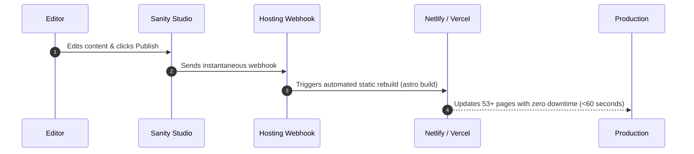

# Techsteps UK — Content Editor Guide

Welcome to the **Techsteps Content Management Guide**. This handbook explains how non-technical editors can update services, sectors, statistics, contact details, and SEO metadata using **Sanity Studio**.

---

## 1. Accessing Sanity Studio

1. Navigate to your dedicated studio URL (e.g. `https://techsteps.sanity.studio` or `http://localhost:3333` during development).
2. Log in using your approved Google, GitHub, or Sanity email account.
3. Once authenticated, you will see the left-hand navigation pane listing all manageable document types:
   * **Site Settings**
   * **Divisions**
   * **Services**
   * **Sectors**
   * **Statistics**
   * **Articles / Insights**
   * **Case Studies**

---

## 2. Managing Services

### How to Add a New Service
1. Click **Services** in the left sidebar.
2. Click the **Create New Service** button (+ icon).
3. Fill in the required fields:
   * **Title**: e.g., `Tape & Media Storage`
   * **Slug**: Click **Generate** to automatically format the URL slug.
   * **Operational Division**: Select one of the 4 divisions (*Information Management*, *IT Lifecycle*, *Secure Shredding*, or *Moving & Relocation*).
   * **Summary**: A 2–3 sentence executive summary.
   * **Customer Problem & Solution**: Clear descriptions of why traditional approaches fail and how Techsteps protects the client.
   * **Key Benefits**: Click **Add Item** to add bullet points with icons.
   * **Process Steps**: Add the numbered steps (e.g., *1. Assess, 2. Collect, 3. Secure, 4. Report*).
   * **FAQs**: Add common client questions and detailed answers.
4. Set the **SEO Meta Title** and **Meta Description**.
5. Click **Publish** at the bottom right.

### How to Edit an Existing Service
1. Select **Services** and choose the service from the list.
2. Update the text, FAQs, or benefits.
3. Click **Publish**. The website will automatically rebuild and deploy your changes.

---

## 3. Managing Sectors (Defence, NHS, Finance, Government)

1. Click **Sectors** in the sidebar.
2. Select the sector you wish to update (e.g., *Defence & Aerospace*).
3. You can edit:
   * **Tagline**: The highlighted compliance statement below the main title.
   * **Governing Frameworks**: Add or adjust compliance badges (e.g., `JSP 440`, `Caldicott`, `FCA Operational Resilience`).
   * **Challenges & Solutions**: Specific regulatory pain points and our certified remedies.
   * **Sector FAQs**: Questions frequently asked by procurement teams.
4. Click **Publish**.

---

## 4. Updating Verified Statistics

> [!IMPORTANT]
> **Strict Verification Policy**: Never enter placeholder values such as `+0M` or `+0K`. If a statistic is unverified or unavailable, set **Visible on Live Site** to `False` to hide it cleanly.

1. Click **Statistics** in the sidebar.
2. Select a metric (e.g., *Landfill Diversion Rate*).
3. Edit the fields:
   * **Value**: e.g., `100` or `99.99`
   * **Prefix**: e.g., `£` or `>`
   * **Suffix**: e.g., `%` or `tonnes`
   * **Label**: e.g., `Landfill Diversion Rate`
   * **Context Note**: Short explanatory footnote for audit transparency.
4. Click **Publish**.

---

## 5. Updating Company Contact & UK NAP

To update phone numbers, physical address, or corporate emails sitewide:

1. Click **Site Settings** (this is a single configuration document).
2. Update:
   * **Primary Phone Number**: e.g., `+44 (0) 20 7946 0888`
   * **Primary Contact Email**: e.g., `enquiries@techsteps.co.uk`
   * **UK Head Office Address**: Street, city, county, postcode.
   * **Operating Hours**: Displayed across the website and contact headers.
3. Click **Publish**.
   * *Note: Updating Site Settings updates the header, footer, contact page, and Google Schema structured data sitewide automatically!*

---

## 6. How the Website Rebuild Works

1. Whenever you click **Publish**, Sanity sends a secure notification (webhook) to Netlify / Vercel.
2. The server builds the fresh HTML pages in approximately 6 seconds.
3. Your new content is live across the globe with zero server downtime and blazing fast load times.
