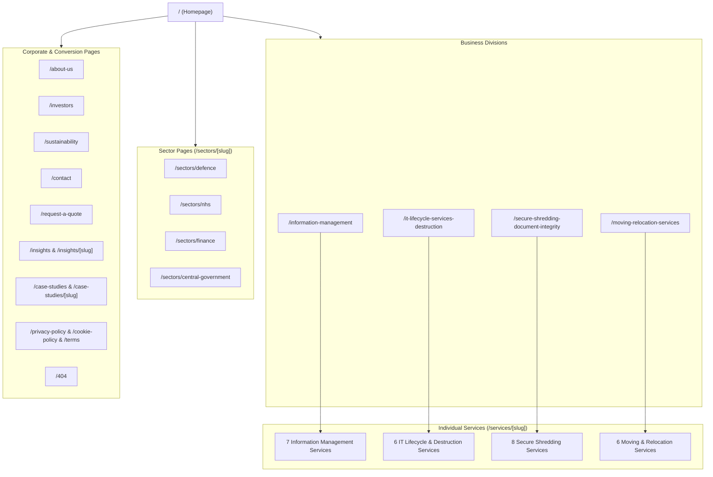
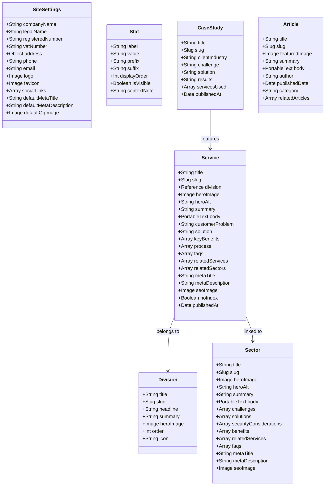
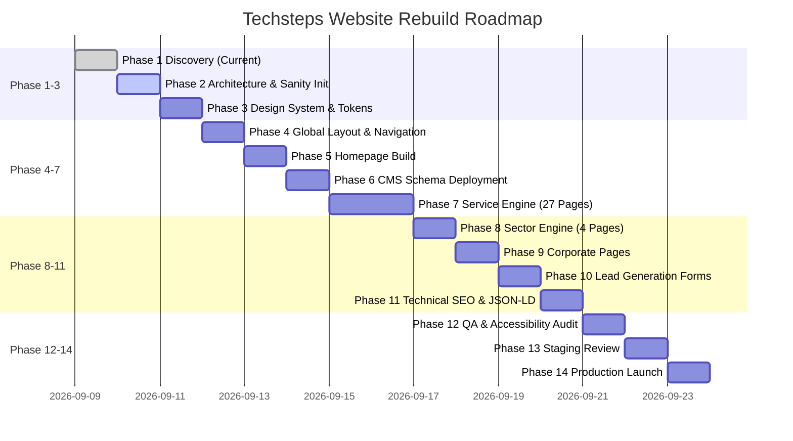

# Techsteps Corporate Website Rebuild — Phase 1 Discovery & Implementation Plan

Rebuilding the complete **Techsteps UK corporate website** from scratch using **Astro**, **TypeScript**, **Tailwind CSS**, and **Sanity CMS (Headless)**.

This implementation plan delivers **Phase 1 (Discovery)** and outlines the end-to-end architecture across all subsequent phases to ensure a high-performance, accessible (WCAG 2.2 AA), enterprise-grade, SEO-optimized digital platform with zero dependencies on WordPress or Elementor.

---

## User Review Required

> [!IMPORTANT]
> **Key Architectural Decisions & Client Clarifications**:
> 1. **Client Verified Data (Zero-Fabrication Policy)**: All statistics (tonnes shredded, items scanned, etc.), certification badges (ISO 27001, ADISA, Cyber Essentials Plus), and the "86 UK sites" claim must be formally verified. Unverified items will be conditionally hidden or marked `[CLIENT CONTENT REQUIRED]`.
> 2. **NAP & Contact Migration**: The erroneous US/New Jersey contact details from the legacy WordPress site will be eliminated in favor of verified UK operational headquarters and regional depots.
> 3. **CMS Workflow & Cost Control**: Sanity Free Plan will be used with local and hosted Sanity Studio schemas, paired with static generation (`astro build`) and webhook re-validation on Netlify/Vercel for zero ongoing CMS licensing costs during development.
> 4. **Broken Link Remediation**: The legacy `devopstrio.co.uk` link in service CTAs is removed and mapped to internal Techsteps service routing (`/services/secure-it-disposal`).

---

## 1. Complete Sitemap



---

## 2. Complete Page Inventory

| # | Page Type | Canonical URL Route | Dynamic / Static | Primary Purpose & Conversion Goal |
|---|-----------|---------------------|------------------|-----------------------------------|
| 1 | Homepage | `/` | Static (ISR/SSG) | Enterprise value proposition, division routing, trust signals, CTA to quote |
| 2 | Division | `/information-management` | Static | Information lifecycle overview, service cluster navigation |
| 3 | Division | `/it-lifecycle-services-destruction` | Static | ITAD, hardware security, secure destruction overview |
| 4 | Division | `/secure-shredding-document-integrity` | Static | Physical destruction, compliance, recycling workflows |
| 5 | Division | `/moving-relocation-services` | Static | Specialist relocation, heritage/lab moves, IT project transport |
| 6–32 | Services (27) | `/services/[slug]` | Dynamic Route | Problem-solution, certified process, compliance benefits, RFQ |
| 33–36 | Sectors (4) | `/sectors/[slug]` | Dynamic Route | Sector compliance (MOD, NHS IG, FCA, GovSec), tailored service bundles |
| 37 | Corporate | `/about-us` | Static | Company ethos, leadership, certified chain of custody, UK footprint |
| 38 | Corporate | `/investors` | Static | Corporate governance, ESG alignment, operational resilience |
| 39 | Corporate | `/sustainability` | Static | Circular economy metrics, zero-to-landfill, WEEE/carbon reduction |
| 40 | Contact | `/contact` | Static | Direct office locator, verified UK NAP, enquiry form |
| 41 | Conversion | `/request-a-quote` | Static | Multi-step B2B quote request with qualification filters |
| 42 | Knowledge | `/insights` | Static | Thought leadership, regulatory updates (NIS 2, WEEE, GDPR) |
| 43 | Article | `/insights/[slug]` | Dynamic Route | In-depth editorial with Portable Text, related services, author cards |
| 44 | Evidence | `/case-studies` | Static | Client problem-solving proofs and quantified lifecycle outcomes |
| 45 | Case Study | `/case-studies/[slug]` | Dynamic Route | Problem/solution/outcome methodology breakdown |
| 46–48 | Legal | `/privacy-policy`, `/cookie-policy`, `/terms` | Static | GDPR compliance, cookie transparency, terms of service |
| 49 | Error | `/404` | Static | Helpful custom 404 with search/quick jump links |

---

## 3. Division & Service Inventory (All 27 Services)

### Division 1: Information Management (`/information-management`)
1. **Document Storage** (`/services/document-storage`): Barcode-tracked physical archival, climate-controlled facilities, BS 4971 standards.
2. **Tape & Media Storage** (`/services/tape-media-storage`): Fire-suppressed media vaulting, rotational pickup, magnetic tape longevity.
3. **Heritage Storage** (`/services/heritage-storage`): Conservation-grade storage for rare archives, delicate artifacts, and national treasures.
4. **Vault Storage** (`/services/vault-storage`): Class-leading high-security vaulting with biometric perimeter defense and round-the-clock monitoring.
5. **Document Scanning** (`/services/document-scanning`): High-speed optical digitization, OCR indexing, secure batch scanning into DMS/cloud.
6. **Digital Mailroom** (`/services/digital-mailroom`): Automated inbound mail intake, same-day scanning, direct departmental routing.
7. **Document Management** (`/services/document-management`): End-to-end retention scheduling, compliance auditing, unified retrieval systems.

### Division 2: IT Lifecycle Services & Destruction (`/it-lifecycle-services-destruction`)
8. **Secure IT Disposal** (`/services/secure-it-disposal`): Secure WEEE-compliant asset decommission, serial number audit, sanitization.
9. **Secure Collection Services** (`/services/secure-collection-services`): GPS-tracked, secure caged transit vehicles with vetted security personnel (BS 7858).
10. **IT Asset Disposition Services (ITAD)** (`/services/it-asset-disposition-services`): Full lifecycle disposition, asset cataloging, environmental compliance.
11. **IT Asset Management Services (ITAM)** (`/services/it-asset-management-services`): Decommissioning logistics, inventory verification, hardware auditing.
12. **Remarketing & Recycling** (`/services/remarketing-recycling`): Refurbishment, value recovery back to client balance sheets, responsible component recycling.
13. **Ultra Secure Hard Drive Destruction** (`/services/ultra-secure-hard-drive-destruction`): On-site/off-site high-torque degaussing and DIN 66399 shredding (H-4/H-5).

### Division 3: Secure Shredding & Document Integrity (`/secure-shredding-document-integrity`)
14. **Home Shredding** (`/services/home-shredding`): Secure tamper-evident sacks for remote workforce confidential waste destruction.
15. **On-Site Shredding** (`/services/on-site-shredding`): Mobile cross-cut shredding trucks with immediate on-location Certificate of Destruction.
16. **Off-Site Shredding** (`/services/off-site-shredding`): High-volume plant shredding with sealed chain-of-custody transfer and baling.
17. **Product Shredding** (`/services/product-shredding`): Brand protection destruction of counterfeit goods, prototypes, branded uniforms, and ID badges.
18. **Simpler Recycling Services** (`/services/simpler-recycling-services`): Turnkey business waste segregation matching the new UK Simpler Recycling regulations.
19. **Disposal Services** (`/services/disposal-services`): Safe clearing of specialized commercial materials and bulk office clear-outs.
20. **Cardboard Recycling** (`/services/cardboard-recycling`): Clean-stream commercial cardboard baling, collection, and mill delivery.
21. **Dry Mixed Recycling** (`/services/dry-mixed-recycling`): DMR bins and collection for co-mingled paper, cans, plastics, and card.

### Division 4: Moving & Relocation Services (`/moving-relocation-services`)
22. **Business Relocations** (`/services/business-relocations`): Turnkey commercial office migration with zero business disruption.
23. **Laboratory Relocations & Storage** (`/services/laboratory-relocations-storage`): Temperature-controlled sample transport, hazardous material safety protocols.
24. **Heritage Relocations & Storage** (`/services/heritage-relocations-storage`): White-glove historical artifact packing, curatorial coordination, seismic transport.
25. **Europe & International Domestic Moves** (`/services/europe-international-domestic-moves`): Customs clearance, secure intercontinental freight, bonded storage.
26. **IT Relocations Specialist** (`/services/it-relocations-specialist`): Server de-racking/re-racking, structured cabling, data center migration.
27. **Project Management** (`/services/project-management`): Dedicated PRINCE2/PMP logistics leads overseeing end-to-end relocation execution.

---

## 4. Sector Inventory

1. **Defence** (`/sectors/defence`):
   - Focus: Official-Sensitive to Top Secret clearance, SC/DV-vetted staff, strict chain-of-custody, JSP 440 adherence, on-site mechanical destruction.
2. **NHS & Healthcare** (`/sectors/nhs`):
   - Focus: Caldicott principles, patient medical records preservation (BS 10008), HIPAA/GDPR health data destruction, secure courier transit.
3. **Finance & Banking** (`/sectors/finance`):
   - Focus: FCA compliance, customer financial records archiving, PCI-DSS data sanitization, comprehensive audit trails for regulatory reporting.
4. **Central Government** (`/sectors/central-government`):
   - Focus: Crown Commercial Service frameworks, government sustainability targets (Greening Government Commitments), cross-departmental secure logistics.

---

## 5. Sanity CMS Content Model

The CMS schema is engineered as a **structured content repository**, specifically avoiding the maintenance pitfalls of generic visual page builders.



---

## 6. URL & Redirect Architecture

### Redirect Rules (Netlify `_redirects` / Astro redirects config)
- **Legacy broken service link fix**: `devopstrio.co.uk` ➔ `https://techsteps.co.uk/services/secure-it-disposal`
- **Legacy WordPress paths**:
  - `/services/` ➔ `/it-lifecycle-services-destruction` (or division landing)
  - `/about/` ➔ `/about-us` (301)
  - `/contact-us/` ➔ `/contact` (301)
  - `/request-quote/` ➔ `/request-a-quote` (301)
  - `/wp-content/*` ➔ `/` (410 or redirect home)
  - `/wp-admin/*` ➔ `/` (404)
- **Enforce canonical format**:
  - Force HTTPS
  - Remove trailing slashes (consistent `trailingSlash: 'never'` in Astro config)
  - Normalize casing to lowercase

---

## 7. SEO Architecture & JSON-LD Implementation

### Technical SEO Foundations
1. **Metadata & OpenGraph**: Unique meta title (`<Title> | Techsteps UK`), meta description (150–160 chars), OpenGraph tags, Twitter Cards, and canonical URLs on every single page.
2. **Heading Strictness**: Exactly one `<h1>` per page. Predictable `<h2>` (major sections) and `<h3>` (cards/subsections) hierarchy.
3. **Automated XML Sitemap**: Generated via `@astrojs/sitemap`, excluding drafts and `noIndex` content.
4. **Optimized Robots.txt**: Clean crawl directives with sitemap reference.

### Schema.org JSON-LD Specifications

```html
<!-- Sitewide Organization Schema -->
<script type="application/ld+json">
{
  "@context": "https://schema.org",
  "@type": "Corporation",
  "name": "Techsteps",
  "url": "https://techsteps.co.uk",
  "logo": "https://techsteps.co.uk/assets/brand/techsteps-logo.svg",
  "contactPoint": {
    "@type": "ContactPoint",
    "telephone": "+44-[CLIENT-VERIFIED-PHONE]",
    "contactType": "customer service",
    "areaServed": "GB",
    "availableLanguage": "en"
  },
  "address": {
    "@type": "PostalAddress",
    "streetAddress": "[CLIENT-VERIFIED-UK-STREET]",
    "addressLocality": "[CLIENT-VERIFIED-CITY]",
    "postalCode": "[CLIENT-VERIFIED-POSTCODE]",
    "addressCountry": "GB"
  }
}
</script>

<!-- Service Page Schema -->
<script type="application/ld+json">
{
  "@context": "https://schema.org",
  "@type": "Service",
  "name": "Secure IT Disposal",
  "provider": {
    "@type": "Corporation",
    "name": "Techsteps"
  },
  "areaServed": "GB",
  "serviceType": "IT Asset Disposition & Secure Data Destruction",
  "description": "Certified WEEE-compliant IT asset retirement and data destruction..."
}
</script>
```

---

## 8. Component Inventory

```
src/
├── components/
│   ├── global/
│   │   ├── Header.astro           // Sticky, high-contrast, accessible
│   │   ├── Navigation.astro       // Desktop links & mega menu trigger
│   │   ├── MegaMenu.astro         // 4-division categorized mega menu
│   │   ├── MobileDrawer.astro     // Accessible focus-trapped hamburger navigation
│   │   ├── Footer.astro           // UK NAP, accreditations, site map, legal links
│   │   └── CookieConsent.astro    // Lightweight, GDPR-compliant consent manager
│   ├── layout/
│   │   ├── Container.astro        // Fluid container with max-w constraints
│   │   └── Section.astro          // Predictable vertical padding & themed backgrounds
│   ├── hero/
│   │   ├── HeroHome.astro         // High-impact enterprise headline, trust badges, primary CTA
│   │   ├── HeroService.astro      // Breadcrumb, title, problem statement, RFQ button
│   │   ├── HeroDivision.astro     // Division overview, stats, service clusters
│   │   └── HeroSector.astro       // Industry context, security clearance highlight
│   ├── services/
│   │   ├── ServiceCard.astro      // Card with image, title, summary, descriptive CTA
│   │   ├── ServiceGrid.astro      // Responsive CSS grid with division filtering
│   │   ├── ProcessSteps.astro     // Step-by-step visual lifecycle diagram (Assess->Report)
│   │   └── BenefitsList.astro     // Highlighted value proposition points with SVG icons
│   ├── sectors/
│   │   ├── SectorCard.astro       // Sector entry point with relevant compliance tags
│   │   └── SectorGrid.astro       // 4-column sector display
│   ├── content/
│   │   ├── StatCounter.astro      // CMS-driven verified statistics with fallback hiding
│   │   ├── AccordionFaq.astro     // Fully accessible HTML5 details/summary or ARIA accordion
│   │   ├── PortableText.astro     // Clean Sanity Rich Text renderer without raw HTML vulnerabilities
│   │   └── TrustLogos.astro       // Verified certification badges (ISO, ADISA, etc.)
│   ├── forms/
│   │   ├── ContactForm.astro      // Accessible form with honeypot spam protection
│   │   ├── QuoteForm.astro        // Multi-select service/sector enquiry with validation
│   │   └── FormInput.astro        // Floating label / clean accessible input component
│   └── seo/
│       ├── SeoHead.astro          // Meta tags, canonical, OpenGraph, JSON-LD injector
│       └── Breadcrumbs.astro      // Schema-enriched visual breadcrumbs
```

---

## 9. Design System Tokens (Tailwind CSS)

```javascript
// tailwind.config.mjs (Design System Foundations)
export default {
  content: ['./src/**/*.{astro,html,js,jsx,md,mdx,svelte,ts,tsx,vue}'],
  theme: {
    extend: {
      colors: {
        brand: {
          navy: '#0B192C',        // Deep corporate foundation
          blue: '#1E3E62',        // Modern enterprise blue
          accent: '#008170',      // Balanced teal for focus/active states
          green: '#005B41',       // Selective sustainable green (used sparingly)
          charcoal: '#1E201E',    // High-contrast typography
          slate: '#F5F7FA',       // Light neutral backgrounds
          muted: '#64748B',       // Subdued secondary text
        },
      },
      fontFamily: {
        sans: ['Inter', 'system-ui', '-apple-system', 'sans-serif'],
        display: ['Plus Jakarta Sans', 'Inter', 'sans-serif'],
      },
      borderRadius: {
        'card': '0.75rem',        // Controlled, professional curve (12px)
        'button': '0.5rem',       // Clean button curve (8px)
      },
    },
  },
};
```

---

## 10. Required Client Information (Discovery Checklist)

Before launch, the following verified data points will be collected from Techsteps UK:

| Item | Status | Action Required |
|------|--------|-----------------|
| **UK Primary NAP** | `Pending Client` | Full UK Registered Address, Company Number, VAT Number, Primary UK Telephone |
| **86 UK Sites Claim** | `Pending Client` | Verification of the exact depot/site count before publication |
| **Operating Statistics** | `Pending Client` | Verified figures for Tonnes Shredded, Items Scanned, Desktops Decommissioned |
| **Accreditations & Badges** | `Pending Client` | High-res vector badges for ISO 9001, ISO 14001, ISO 27001, ADISA, Cyber Essentials |
| **Service Lead Emails** | `Pending Client` | Destination routing for Contact and RFQ form submissions |
| **Brand Vectors** | `Pending Client` | High-res SVG logo files (Dark, Light, Icon mark) |

---

## 11. Image & Asset Procurement Plan

- **Enterprise Technology Visuals**: High-resolution, professional imagery representing cleanroom environments, secure data centers, locked courier transit, and industrial degaussers.
- **Iconography**: Curated Lucide-style SVG icons ensuring consistent stroke weight (1.5px) and enterprise tone.
- **Optimization Strategy**: Astro `<Image />` component with automated WebP/AVIF generation, explicit layout sizing (`aspect-ratio`), and lazy loading for sub-fold content.

---

## 12. Complete Development Roadmap (Phases 1–14)



---

## Verification Plan

### Automated Checks
- `npm run check` (Astro diagnostic and TypeScript type checks)
- `npm run build` (Ensuring all 36+ static routes compile without broken imports or missing parameters)
- Lighthouse CI / Core Web Vitals audits (target 90+ across Performance, Accessibility, Best Practices, SEO)
- Automated HTML validator and dead-link checker

### Manual Verification
- Testing keyboard accessibility (Tab, Enter, Escape, Arrow keys) across the Mega Menu, Mobile Drawer, and Quote Form
- Verifying complete elimination of the `devopstrio.co.uk` link and US contact information
- Validating JSON-LD output in Google's Rich Results Testing Tool
